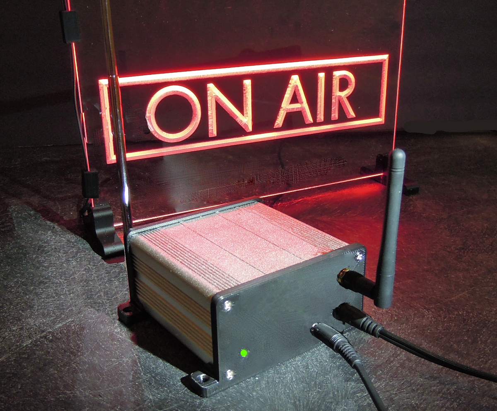
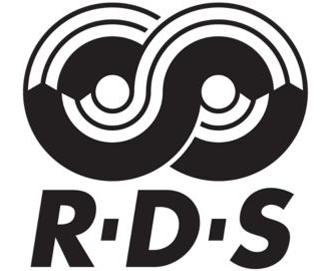

# 

# INTRODUCTION

# 

PixelRadio is a FM Radio Transmitter with RDS (Radio Data System) capabilities.
It was developed for holiday "Pixel" displays (e.g., animated Christmas lights) and house projection installations.
This project is intended for pixel hobbyist that not only want to enhance their holiday show but also enjoy building electronic projects.

Besides transmitting audio (voice/music) to drive-by visitors, it can also send RadioText messages to RDS compatible automobile radios.
The RadioText can be anything you want. Such as artist name or information about your animated pixel show.

Please be advised that PixelRadio is NOT a commercial product.
It was developed by a hobbyist for personal use.
It is being shared as an open source project and further development by end-users is encouraged.
Please feel free to use the published information to build your own PixelRadio system.

## WHAT IS RDS?



The Radio Data System (RDS / RBDS) enables FM radio transmitters to send RadioText messages to RDS compatible receivers. Which is perfect for your drive-by pixel audience because late model automobiles have infotainment screens that display RDS messages while listening to the FM radio station. RadioText from commercial broadcasters typically displays the station's name and the artist/song information.

With PixelRadio you can broadcast stereo music as well as send RadioText messages about your pixel light show. Such as hours of operation or details on how to donate to the hosting event's charity organization. Or use it to display the name of the songs you are currently playing. PixelRadio is flexible so you can do any combination of those things.

## IMPORTANT INFORMATION

The radio transmitter employs *very low* RF power.
Broadcast distance with a simple 76cm long wire aerial is about 100 meters (300 feet).
This is adequate for reaching drive-by visitors.

>The low power is a best-effort attempt to satisfy the unlicensed RF regulations found in countries such as the USA.
>However, no claims are being made that it is complaint with any rules.
>It is up to the operator to ensure that this RF device is operated in accordance with their government's regulations.

Any component sources that are mentioned are for your convenience. Please feel free to use your favorite supplier to acquire parts.

Kits and/or ready-to-use products are NOT available.
The project's creator does NOT sell any item used in this project.

All information is provided as-is.
YOU must accept all responsibility for the construction and use of the project.


## FEATURES

Here is a brief summary of PixelRadio's features.

* Digitally synthesized transmitter, high RF stability.

* 88.1 to 107.9 MHz FM tuning range, 100 KHz Increments.

* High quality audio performance.

* Supports RDS RadioText messaging, RBDS compatible.

* RDS can be controlled remotely using MQTT, HTTP, or Serial commands.

* Extensive programmable features, accessible via web interface.

* Uses Local WiFi network (not Cloud based).

* Responsive Web design supports popular desktop and mobile Web browsers.

* Micro SD Card slot for system configuration backups.

* Test Tone feature provides convenient station identification during setup.

* Optional high current output to control a 5V or 12V ON-AIR sign.

* Three user configurable digital I/O pins allow On/Off control of other devices.


## SKILLS REQUIRED:

### Hardware
The project's hardware assembly is suitable for electronic circuit builders with moderate experience.

Artwork files are provided for the two sided printed circuit board (PCB).
The PCB files are in the RS274X Gerber format required by commercial PC board fabricators.

The soldered parts are through-hole type. No SMD components need to be soldered.

Build documentation is just a one page schematic.
Step-by-step wiring instructions or pictorial wiring diagrams are not provided.
Basic build information is found in the [Hardware section](./docs/Hardware).

### Software
The source code files are found [here](/src/).
Some programming experience will be needed if you intend to make improvements to the code.

## SOFTWARE BUILD REQUIREMENTS

<span>


Compiling the source code requires VSCode with the [Platformio IDE](https://platformio.org/platformio-ide) extension.
The software is written in C and requires PlatformIO's Espressif32 board platform and Arduino framework.
</span>

This project uses open source ESP32 Arduino Libraries.
However, the source code will not successfully compile with the Arduino IDE. Please use PlatformIO.

&nbsp;&nbsp;&nbsp;

---

### KNOWN ISSUES

Web page disconnects may occur randomly. Simply refresh the browser if this occurs.

### RELEASE NOTES

```1.0  : Apr-05-2022, PixelRadio V1.0, official release to the public.```

&nbsp;&nbsp;&nbsp;

# USER MANUAL

The instruction manual documents can be found here: [User Manual](./docs/User_Manual/README.md).
