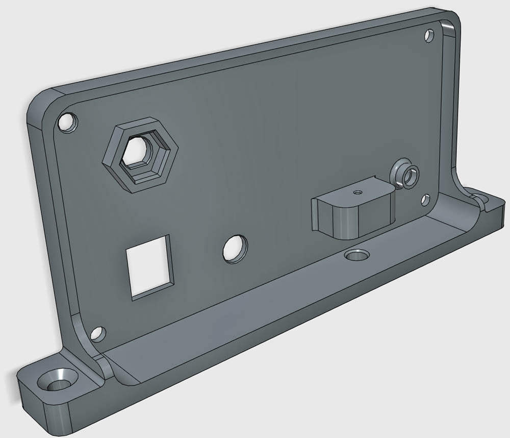
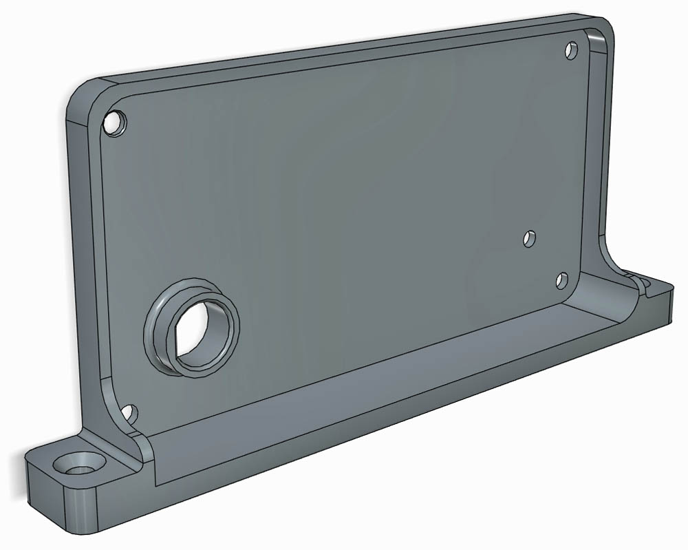

# 

# 3D PRINTED PARTS

PixelRadio is a FM Radio Transmitter with RDS (Radio Data System) capabilities.
It was developed for holiday "Pixel" displays (e.g., animated Christmas lights).

The circuit board is designed to slide into an off-the-shelf metal enclosure (see parts list for details).
The enclosure includes two metal end panels that can be cut/drilled to accommodate the external connectors. 

However, if you have access to a 3D printer you can make your own plastic end panels that are ready-to-install.
No cutting or drilling, how great is that!

Another advantage of using the printed end panels is that the plastic material doesn't adversely affect WiFi range when the ESP32's internal WiFi antenna is used.

---

&nbsp;&nbsp;&nbsp;

## FRONT COVER

The 3D printed Front Cover has holes for the DC Power jack, Audio jack, LED, and optional WiFi antenna connector.
There's also a circuit board retaining tab for holding the cover to the PCB with a single M2 screw.

# 

&nbsp;&nbsp;&nbsp;

## BACK COVER

The 3D printed Back Cover has holes for the FM Antenna Jack and optional On-Air Sign cable. 

# 

&nbsp;&nbsp;&nbsp;

## 3D PRINTING TIPS

STL files are provided for both end panels.
You can use ABS or PLA filament.
No need for supports or rafts.

### STL FILE SCALING
Use your G-Code slicer to re-scale the STL files to account for filament shrinkage.
For example, typical ABS filament requires a 100.8% rescale, but this can vary.
So check the shrinkage specification of your filament to determine the ideal rescaling value.
