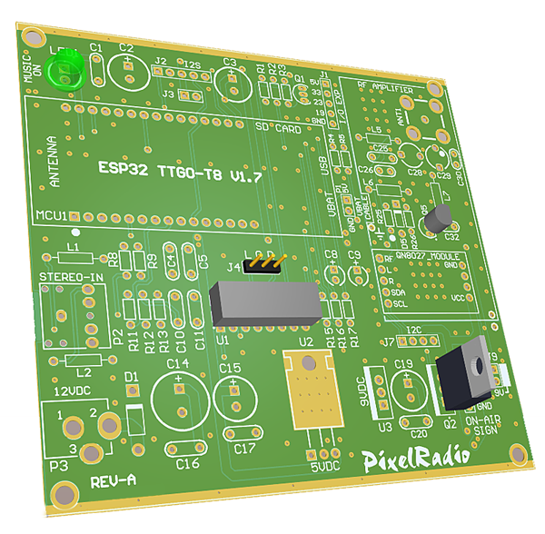

# 

# PCB ARTWORK

PixelRadio is a FM Radio Transmitter with RDS (Radio Data System) capabilities. It was developed for holiday "Pixel" displays (e.g., animated Christmas lights).

A Printed Circuit Board (PCB) is highly recommended for building your PixelRadio. All the artwork files for the two-sided PCB can be downloaded here.

The PCB files are in the RS274X gerber format required by commerical PC board fabricators.

For lowest cost PCB fabrication it is suggested to use an off-shore (China, Hong Kong) board house.
Typical costs are about $20 USD delivered to your door.
>Note: The fabricator does not supply components and they do not assemble your board; that's your job.

## BOARD SPECIFICATIONS

Typical board specifications for lowest PCB fabrication cost are as follows:

``Base Material: FR-4`` \
``Layers: 2`` \
``Dimension: 99.57 mm* 94.36 mm`` \
``Different Design: 1`` \
``Delivery Format: Single PCB``\
``PCB Thickness: 1.2mm``\
``Impedance: No``\
``PCB Color: Green``\
``Silkscreen: White``\
``Surface Finish: HASL(with lead)``\
``Deburring/Edge rounding: No``\
``Outer Copper Weight: 1``\
``Gold Fingers: No``\
``Castellated Holes: No``\
``4-Wire Kelvin Test: No``\
``Material Type:FR4-Standard Tg 130-140C``\
``Appearance Quality:IPC Class 2 Standard``

**IMPORTANT:** The 1.2mm board thickness is needed to maintain signal path impedance in the RF Circuity. 
Also, this thickness fits the board mounting slot provided by the recommended metal enclosure.

Please feel free to change the PCB color, Silkscreen Color, or Surface Finish (lead free).
However, depending on supplier the total cost may increase.
