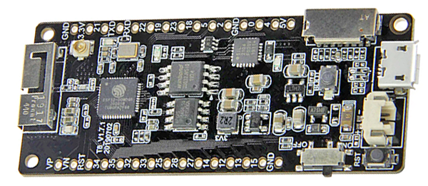
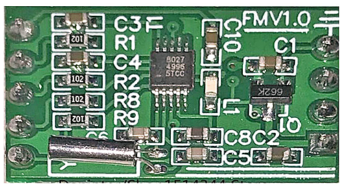
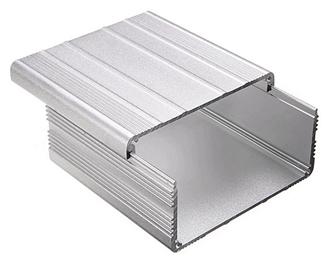
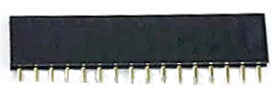
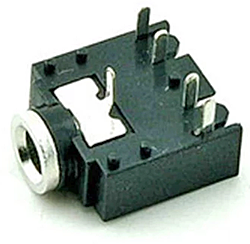
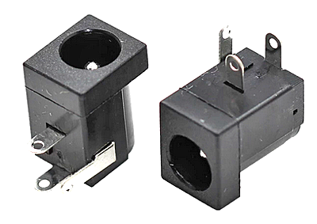
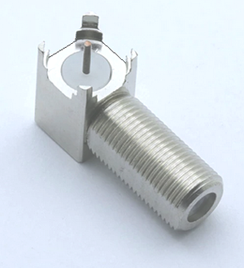
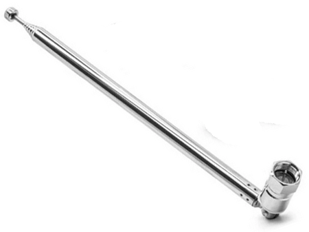

# 

# PARTS LIST

PixelRadio is a FM Radio Transmitter with RDS (Radio Data System) capabilities. It was developed for holiday "Pixel" displays (e.g., animated Christmas lights).

This document is the Project's Bill of Materials.
Any mentioned component suppliers are for your convenience.
Please feel free to use your favorite supplier.

The project's creator is NOT affiliated with any vendor.
The provided sources include many of the suppliers used in author's original build.
That said, they are only suggestions and are to be purchased at your own risk.

### THE FINE PRINT
*All information is provided as-is.
YOU must accept all responsibility for the construction and use of the project.*

---

**Important Notes:** Most of the parts have similar looking variants that may not be compatible with the project. Therefore, consult the photos shown below to confirm you are buying the exact item needed.

**Fatherly Advice:** Many of the electronic components are very low cost, so it is highly recommended to add a spare to your order in case of electrical "accidents."

&nbsp;&nbsp;&nbsp;

---

# COMPONENT BILL OF MATERIALS

<table style="font:8pt Segoe UI" border="1" cellspacing="0" cellpadding="1" bgcolor="#FFFFFF">
      <thead style="font:bold; background-color:#C0C0C0">
        <tr valign="top">
          <td align="center" width="10%"><b>QTY</b></td>
          <td align="center" width="20%"><b>DESIGNATOR</b></td>
          <td align="center" width="15%"><b>VALUE</b></td>
          <td align="center" width="55%"><b>DESCRIPTION</b></td>
        </tr>
      </thead>
      <tr valign="top">
        <td align="right">1</td>
        <td align="left">ANT1</td>
        <td align="left">F-CON</td>
        <td align="left">Right Angle PCB F-Connector</td>
      </tr>
      <tr valign="top">
        <td align="right">1</td>
        <td align="left">ANT1-WHIP</td>
        <td align="left">Antenna</td>
        <td align="left">76cm Telescoping Rod Antenna with F-Connector</td>
      </tr>
      <tr valign="top">
        <td align="right">7</td>
        <td align="left">C1, C4, C5, C11, C16, C17, C20</td>
        <td align="left">0.1uF 50V</td>
        <td align="left">Monolithic Ceramic (MLCC) Capacitor</td>
      </tr>
      <tr valign="top">
        <td align="right">3</td>
        <td align="left">C2, C15, C19</td>
        <td align="left">470uF 16V</td>
        <td align="left">Electrolytic Capacitor, Radial</td>
      </tr>
      <tr valign="top">
        <td align="right">1</td>
        <td align="left">C3</td>
        <td align="left">100uF 16V</td>
        <td align="left">Electrolytic Capacitor, Radial</td>
      </tr>
      <tr valign="top">
        <td align="right">2</td>
        <td align="left">C8, C9</td>
        <td align="left">4.7uF 16V</td>
        <td align="left">Electrolytic Capacitor, Radial</td>
      </tr>
      <tr valign="top">
        <td align="right">1</td>
        <td align="left">C10</td>
        <td align="left">0.01uF 50V</td>
        <td align="left">Ceramic Disc or Mono Ceramic Capacitor</td>
      </tr>
      <tr valign="top">
        <td align="right">1</td>
        <td align="left">C14</td>
        <td align="left">1000uF 16V</td>
        <td align="left">Electrolytic Capacitor, Radial</td>
      </tr>
      <tr valign="top">
        <td align="right">2</td>
        <td align="left">C26, C33</td>
        <td align="left">1000pF 50V</td>
        <td align="left">Ceramic Disc Capacitor, type C0G (NP0)</td>
      </tr>
      <tr valign="top">
        <td align="right">3</td>
        <td align="left">C27, C28, C31</td>
        <td align="left">NA</td>
        <td align="left">Not Installed</td>
      </tr>
      <tr valign="top">
        <td align="right">3</td>
        <td align="left">C29, C32, C34</td>
        <td align="left">220pF 50V</td>
        <td align="left">Ceramic Disc Capacitor, type C0G (NP0)</td>
      </tr>
      <tr valign="top">
        <td align="right">1</td>
        <td align="left">D1</td>
        <td align="left">1N5819</td>
        <td align="left">1A Schottky Diode, DO-41</td>
      </tr>
      <tr valign="top">
        <td align="right">7</td>
        <td align="left">J1, J2, J3, J4, J5, J7, J8</td>
        <td align="left">PCB PADS</td>
        <td align="left">Solder Pads, Leave Empty</td>
      </tr>
      <tr valign="top">
        <td align="right">1</td>
        <td align="left">J9</td>
        <td align="left">HDR2P</td>
        <td align="left">Use 2-Pin 0.1" Header or Wire Jumper</td>
      </tr>
      <tr valign="top">
        <td align="right">1</td>
        <td align="left">P1</td>
        <td align="left">ESP32 VBAT Cable</td>
        <td align="left">2-PIN Cable (included with ESP32)</td>
      </tr>
      <tr valign="top">
        <td align="right">1</td>
        <td align="left">P2</td>
        <td align="left">PJ307</td>
        <td align="left">PJ307 or SJ-3525 3.5mm 5-Pin Audio Jack</td>
      </tr>
      <tr valign="top">
        <td align="right">1</td>
        <td align="left">P3</td>
        <td align="left">DC-005 DC Power Jack, PCB Mount</td>
        <td align="left">2.1mm x 5.5m DC Power Jack, 3-Terminal</td>
      </tr>
      <tr valign="top">
        <td align="right">4</td>
        <td align="left">L1, L2, L6, L8</td>
        <td align="left">390nH (0.39uH)</td>
        <td align="left">RF Inductor, 0.25W, >100mA</td>
      </tr>
      <tr valign="top">
        <td align="right">1</td>
        <td align="left">L5</td>
        <td align="left">10uH</td>
        <td align="left">RF Inductor, 0.25W, >100mA</td>
      </tr>
      <tr valign="top">
        <td align="right">1</td>
        <td align="left">L7</td>
        <td align="left">JUMPER</td>
        <td align="left">Wire Bridge</td>
      </tr>
      <tr valign="top">
        <td align="right">1</td>
        <td align="left">LED1</td>
        <td align="left">GREEN</td>
        <td align="left">3mm Green LED</td>
      </tr>
      <tr valign="top">
        <td align="right">1</td>
        <td align="left">MCU1</td>
        <td align="left">ESP32 (TTGO-T8)</td>
        <td align="left">LilyGo TTGO-T8-ESP32 MCU, V1.7.1</td>
      </tr>
      <tr valign="top">
        <td align="right">1</td>
        <td align="left">Q1</td>
        <td align="left">2N7000P</td>
        <td align="left">N-Channel FET, TO-92</td>
      </tr>
      <tr valign="top">
        <td align="right">1</td>
        <td align="left">Q2</td>
        <td align="left">IRLZ24NPbF</td>
        <td align="left">HEXFET Transistor, TO-220AB</td>
      </tr>
      <tr valign="top">
        <td align="right">2</td>
        <td align="left">Q5, Q6</td>
        <td align="left">S9018</td>
        <td align="left">NPN RF Transistor</td>
      </tr>
      <tr valign="top">
        <td align="right">1</td>
        <td align="left">QN8027_MODULE</td>
        <td align="left">QN8027 9-Pin Module</td>
        <td align="left">QN8027 RF Transmitter Module</td>
      </tr>
      <tr valign="top">
        <td align="right">1</td>
        <td align="left">R1</td>
        <td align="left">470</td>
        <td align="left">1/8W 5% Resistor</td>
      </tr>
      <tr valign="top">
        <td align="right">5</td>
        <td align="left">R2, R3, R11, R13, R15</td>
        <td align="left">10K</td>
        <td align="left">1/8W 5% Resistor</td>
      </tr>
      <tr valign="top">
        <td align="right">2</td>
        <td align="left">R4, R5</td>
        <td align="left">N/A</td>
        <td align="left">Not installed</td>
      </tr>
      <tr valign="top">
        <td align="right">2</td>
        <td align="left">R8, R12</td>
        <td align="left">100K</td>
        <td align="left">1/8W 5% Resistor</td>
      </tr>
      <tr valign="top">
        <td align="right">1</td>
        <td align="left">R9</td>
        <td align="left">33K</td>
        <td align="left">1/8W 5% Resistor</td>
      </tr>
      <tr valign="top">
        <td align="right">2</td>
        <td align="left">R16, R17</td>
        <td align="left">22K</td>
        <td align="left">1/8W 5% Resistor</td>
      </tr>
      <tr valign="top">
        <td align="right">2</td>
        <td align="left">R25, R27</td>
        <td align="left">47K</td>
        <td align="left">1/8W 5% Resistor</td>
      </tr>
      <tr valign="top">
        <td align="right">1</td>
        <td align="left">R26</td>
        <td align="left">150</td>
        <td align="left">1/8W 5% Resistor</td>
      </tr>
      <tr valign="top">
        <td align="right">1</td>
        <td align="left">U1</td>
        <td align="left">CD4052BCN</td>
        <td align="left">CMOS Analog MUX IC, 16P DIP</td>
      </tr>
      <tr valign="top">
        <td align="right">1</td>
        <td align="left">U2</td>
        <td align="left">L7805CV</td>
        <td align="left">5.0V 1A Voltage Regulator, TO-220</td>
      </tr>
      <tr valign="top">
        <td align="right">1</td>
        <td align="left">U3</td>
        <td align="left">L7809CV</td>
        <td align="left">9.0V 1A Voltage Regulator, TO-220</td>
      </tr>
      <tr valign="top">
        <td align="right">1</td>
        <td align="left">12VDC Supply</td>
        <td align="left">12V / 1 Amp Regulated Power Supply</td>
        <td align="left">Use 2 Amp if "On-Air" Sign is installed</td>
      </tr>
</table>

&nbsp;&nbsp;&nbsp;

---

## MODULE INFO

* **LILYGO TTGO T8 V1.7.1 ESP32 8MB PSRAM** &nbsp;&nbsp;\
AliExpress: https://www.aliexpress.com/item/32851423415.html &nbsp;&nbsp;\
&nbsp;&nbsp;

* **QN8027 FM Transmitter Module 76MHZ-108MHz / Stereo / RDS** &nbsp;&nbsp;\
AliExpress: https://www.aliexpress.com/item/4001045766243.html &nbsp;&nbsp;\
&nbsp;&nbsp;

## PASSIVE COMPONENT INFO

* **390nH (0.39uH) Inductor, 0.25W, axial leads, 4 pcs** &nbsp;&nbsp;\
AliExpress: https://www.aliexpress.com/item/32987240448.html &nbsp;&nbsp;

* **10uH Inductor, 0.25W, axial leads** &nbsp;&nbsp;\
AliExpress:  https://www.aliexpress.com/item/32987240448.html &nbsp;&nbsp;

* **All resistors are 1/8W 5%, axial leads** &nbsp;&nbsp;\
AliExpress: https://www.aliexpress.com/item/32917552713.html &nbsp;&nbsp;

* **All ceramic caps are 10%, 50V or higher** &nbsp;&nbsp;\
AliExpress: https://www.aliexpress.com/item/32864984481.html &nbsp;&nbsp;

* **0.1uF Monolithic Ceramic Capacitor, 7 pcs** &nbsp;&nbsp;\
AliExpress: https://www.aliexpress.com/item/32848919879.html &nbsp;&nbsp;

* **All electrolytics caps are 16V, radial leads** &nbsp;&nbsp;\
AliExpress: Multiple sources, do a search. &nbsp;&nbsp;

## SEMICONDUCTOR INFO
* **CD4052 Analog Mux IC, 16-Pin DIP** &nbsp;&nbsp;\
AliExpress: https://www.aliexpress.com/item/1005003112914510.html &nbsp;&nbsp;

* **L7805CV, 5V Voltage Regulator, TO-220** &nbsp;&nbsp;\
AliExpress: https://www.aliexpress.com/item/32842697093.html &nbsp;&nbsp;

* **L7809CV, 9V Voltage Regulator, TO-220** &nbsp;&nbsp;\
AliExpress: https://www.aliexpress.com/item/1005002917876030.html &nbsp;&nbsp;

* **Green LED, 3mm** &nbsp;&nbsp;\
AliExpress: https://www.aliexpress.com/item/4000412915496.html &nbsp;&nbsp;

* **1N5819 Diode, DO-41** &nbsp;&nbsp;\
AliExpress: https://www.aliexpress.com/item/32825165091.html &nbsp;&nbsp;

* **2N7000 MOSFET, TO-92** &nbsp;&nbsp;\
AliExpress: https://www.aliexpress.com/item/1005001830096818.html &nbsp;&nbsp;

* **S9018 RF Transistor, TO-92, 2 pcs** &nbsp;&nbsp;\
AliExpress: https://www.aliexpress.com/item/1005003111341649.html &nbsp;&nbsp;

* **IRLZ24NPbF MOSFET Transistor, TO-220** &nbsp;&nbsp;\
AliExpress: https://www.aliexpress.com/item/32845164480.html &nbsp;&nbsp;

## MECHANICAL INFO
* **100mm x 100mm x 50mm Metal Enclosure** &nbsp;&nbsp;\
AliExpress: https://www.aliexpress.com/item/32818002759.html &nbsp;&nbsp;\
AliExpress: https://www.aliexpress.com/item/32818046679.html &nbsp;&nbsp;\
 &nbsp;&nbsp;

* **Single Row Female Header Socket, 15-Pin, 2.54mm Pitch, 2 pcs** &nbsp;&nbsp;\
AliExpress: https://www.aliexpress.com/item/1005001418544370.html &nbsp;&nbsp;\
&nbsp;&nbsp;

* **PJ307 3.5mm 5-Pin Audio Jack Connector** &nbsp;&nbsp;\
AliExpress: https://www.aliexpress.com/item/32840724709.html &nbsp;&nbsp;\
 &nbsp;&nbsp;

* **DC-005 DC Power Jack** &nbsp;&nbsp;\
AliExpress: https://www.aliexpress.com/item/4001206395694.html &nbsp;&nbsp;\
 &nbsp;&nbsp;

* **Right Angle Female F-Connector** &nbsp;&nbsp;\
AliExpress: https://www.aliexpress.com/item/33056061709.html &nbsp;&nbsp;\
 &nbsp;&nbsp;

* **AliExpress: Telescopic Rod Antenna with F Type Male Connector, 76cm long** &nbsp;&nbsp;\
https://www.aliexpress.com/item/1005003706497822.html &nbsp;&nbsp;\
&nbsp;&nbsp;
