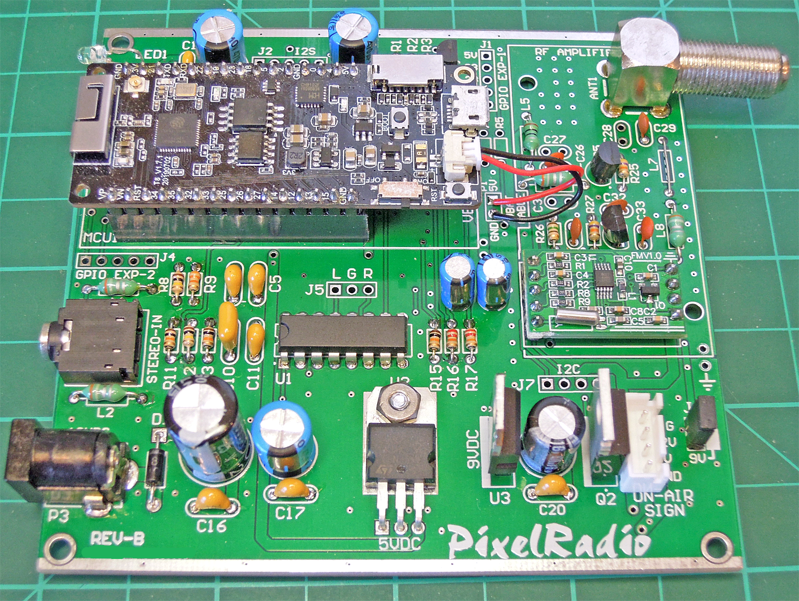
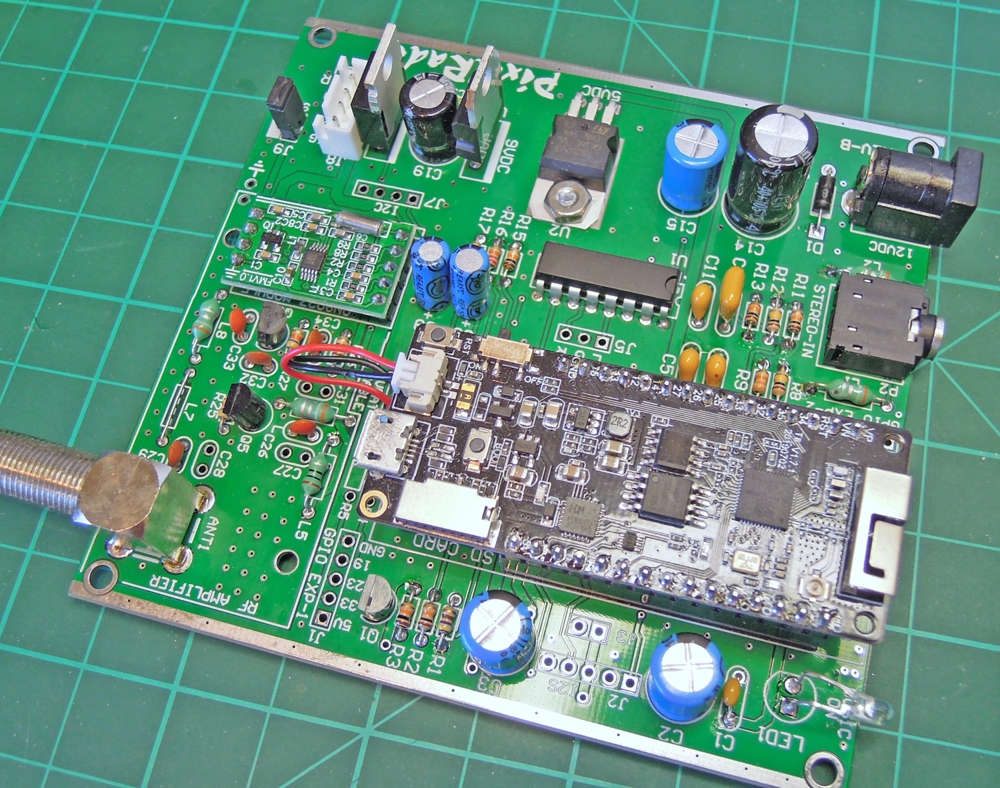

# 

# HARDWARE INFORMATION

PixelRadio is a FM Radio Transmitter with RDS (Radio Data System) capabilities.
Hardware consists of a ESP32 WiFi equipped Microcontroller and low cost QN8027 Digital FM Transmitter module.
Typical range is about 100 meters with a small vertical whip antenna.

&nbsp;&nbsp;&nbsp;

---

## HARDWARE BUILD SKILL LEVEL

Build documentation is just a one page schematic.
Step-by-step wiring instructions or pictorial wiring diagrams are not provided.
The soldered parts are through-hole type.
No SMD components need to be soldered.

&nbsp;&nbsp;&nbsp;

---

## COMPONENT SOURCES

Any component sources that are mentioned are for your convenience. Please feel free to use your favorite supplier to acquire parts.

Kits and/or ready-to-use products are NOT available.
The project's creator does NOT sell any item used in this project.

&nbsp;&nbsp;&nbsp;

---

## BILL OF MATERIALS

Please visit the [Parts List](./PartsList.md) section for the project's bill-of-materials.

&nbsp;&nbsp;&nbsp;

---

## PRINTED CIRCUIT BOARD

PixelRadio can be built using Perfboard construction.
However, a Printed Circuit Board (PCB) is recommended to ensure proper operation of the RF amplifier circuitry.

[Artwork files](../Artwork) are provided for the two-sided PCB.
The PCB files are in the RS274X Gerber format required by commercial PC board fabricators.

The PCB is 95mm x 100mm in size.
It is specifically designed to slide into a low cost metal enclosure.
See the [Parts List](./PartsList.md) for details to the enclosure.

&nbsp;&nbsp;&nbsp;

<table>
  <tr>
    <th>PCB VIEWS</th>
    <th>Click each image for larger view</th>
  </tr>
  <tr>
    <td></td>
    <td></td>
  </tr>
  <tr>
    <td></td>
    <td></td>
  </tr>
</table>

&nbsp;&nbsp;&nbsp;

---

## BASIC ASSEMBLY TIPS

The schematic is the main reference for building the circuitry.

Flush cut all component leads on the solder side.
Clean off all flux residue using solder manufacturer's recommendations.
"No-clean" flux must be removed on all components in the RF circuitry area.

### JUMPER WIRES

Solder jumper wires at locations L7 and J9.
Discarded resistor or capacitor wire leads work well for this.
It's also possible to install a 0.1" 2-Pin header at J9 and use a shorting block instead of a soldered wire.

### SOCKETS

Mount the ESP32 module with two 15-Pin Header Sockets.
The added height from the sockets will provide proper clearance to the mounting tab on the 3D Printed end panel.

The CD4052 IC (U1) can be installed in a 16-PIN DIP socket.
However, using a socket at this location is not necessary.

The QN8027 RF Module must be installed directly on the PCB.
Do **NOT** use a socket to mount the RF module.

### ANTENNA

The telescoping rod antenna looks nice and works well.
However, a 30" piece of bare or insulated wire can be used in place of the telescoping antenna.
Install the antenna so that it points upwards or downwards (vertical polarization).

For more range a dipole antenna can be made from easy-to-obtain hardware store items.\
Assembly instructions are published at the doityourselfchristmas.com site:\
[DiY Dipole Antenna](http://www.doityourselfchristmas.com/wiki/images/a/a7/How_to_make_a_dipole_antenna.pdf)

### ON AIR SIGN

A 5V or 12V LED "On Air" indicator can be installed at J8, as follows:\
J8-1 SIG: LED Gnd (-)\
J8-2 12V: LED 12V Power (+), max 1A\
J8-3 5V: LED 5V Power (+), max 250mA

### EXTERNAL WIFI ANTENNA
The recommended enclosure is aluminum construction, which will shield the ESP32's antenna.
This will reduce WiFi signal strength.
Replacing the supplied metal end panels with PixelRadio's 3D Printed plastic parts will provide better WiFi range.

For best WiFi performance the ESP32 can be updated to use an external 2.4GHz WiFi antenna.
This will increase WiFi range and improve wireless network connectivity.
The ESP32 has a u.FL (IPEX) connector for connecting the external antenna.
Enabling it requires moving a 0402 size SMD resistor.

The resistor is a 0-ohm jumper that normally connects the RF signal to the PCB mounted antenna.
Moving the resistor disables the internal antenna and re-routes the RF signal to the U.FL connector.

Along with moving the resistor you will also need to purchase an 8cm long [SMA to u.FL cable](https://www.aliexpress.com/item/4000848776660.html) and mating [2.4GHz WiFi antenna](https://www.aliexpress.com/item/1005001368629647.html).
The project's 3D Printed End Panel includes a mounting hole for installing the external antenna.

>Note: The cable and antenna are sold in two variants, SMA and RP-SMA. Either can be used, but do NOT mix them; If the cable is SMA then the antenna must also be SMA.

&nbsp;&nbsp;&nbsp;

---

## SOFTWARE INSTALLATION

Please see the [Project Software](../../src/README.md) section for details on flashing the PixelRadio firmware.

&nbsp;&nbsp;&nbsp;

---

## RF CALIBRATION

PixelRadio is a digital device and does not have any adjustable components that are typically found on analog designs.
Therefore RF Calibration is not required.

&nbsp;&nbsp;&nbsp;

---

### THE FINE PRINT

*All information is provided as-is.
YOU must accept all responsibility for the construction and use of the project.*
