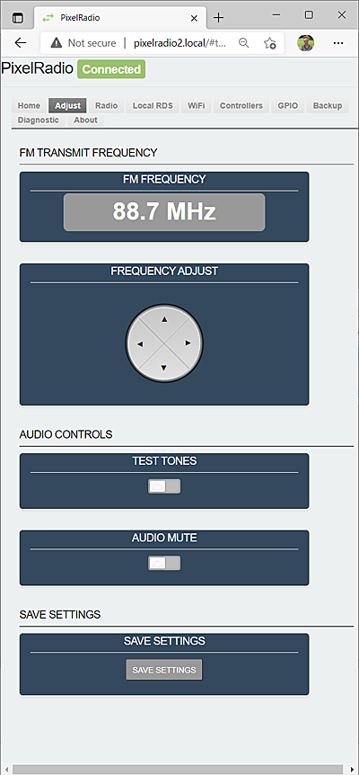

# 

# ADJUST TAB

PixelRadio is a FM Radio Transmitter with RDS (Radio Data System) capabilities.
It was developed for holiday "Pixel" displays (e.g., animated Christmas lights).

The `Adjust Tab` is used to change the FM Radio Frequency and control special audio modes.

&nbsp;&nbsp;&nbsp;

&nbsp;&nbsp;&nbsp;

---

## FREQUENCY ADJUST

The ``Frequency Adjust`` is a 4-way joystick.
The left and right buttons adjust the FM transmit frequency in 100KHz steps.
The up and down buttons provide 1MHz steps.

---

## AUDIO CONTROLS

The Audio Control group provides special audio functions.

### TEST TONES

Enable the ``Test Tone`` feature by moving the slide switch to the right side.
Normal audio content will be replaced by a pleasant tone sequence.
The test tones can be used to help quickly identify your transmitter on a radio receiver.

Test Tone mode also sends a RadioText message with runtime clock that is updated every five seconds.
The RadioText is formatted as follows:

`PIXELRADIO AUDIO TEST HH:MM:SS`

### AUDIO MUTE
Audio can be silenced by moving the ``Audio Mute`` slide switch to the right side.
The RF Carrier and RadioText are not affected.

---

## SAVE SETTINGS

Any changes can be saved as default "Power-Up" settings.
Press the ``Save Settings`` button to store ALL current settings.

>Note: The Test Tone cannot be set as a default setting.

---

&nbsp;&nbsp;&nbsp;

# RETURN TO OVERVIEW

Return to the Menu Overview page: [Click Here](./Overview.md).
