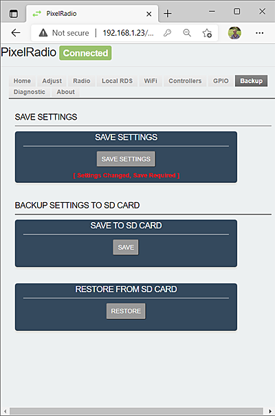

# 

# BACKUP TAB

PixelRadio is a FM Radio Transmitter with RDS (Radio Data System) capabilities.
It was developed for holiday "Pixel" displays (e.g., animated Christmas lights).

The `BACKUP Tab` is used to save and restore system settings.

&nbsp;&nbsp;&nbsp;

<table>
<tr>
<td>

---

## SAVE SETTINGS

`SAVE SETTINGS` is used to save PixelRadio's configuration to flash memory.
No SD Card is required. The saved settings will be automatically restored at each system startup.

Press the button in the `SAVE SETTINGS` panel to save the current settings.

---

## BACKUP SETTINGS TO SD CARD

System settings can be saved on a microSD Card.
>Warning: The backup file contains your WiFi credenitals.
>Store the SD card in a secure location to protect the private data.

### SAVE TO SD CARD

Press the button in the `SAVE TO SD CARD` panel to create a SD Card backup.
The microSD Card (32GB or less) must be formatted as FAT32.
The backup file will be named `/backup.cfg`

### RESTORE FROM SD CARD

Press the button in the `RESTORE FROM SD CARD` panel to restore PixelRadio's setting from the microSD Card.
The backup file MUST be named `/backup.cfg`

</td>
</tr>
</table>

---

## EMERGENCY WIFI CREDENTIALS

To restore only the Wifi Credentials from a microSD Card please see the [EMERGENCY WIFI CREDENTIALS](./README.md#emergency-wifi-credentials) instructions.

&nbsp;&nbsp;&nbsp;

---

# RETURN TO OVERVIEW

Return to the Menu Overview page: [Click Here](./Overview.md).
