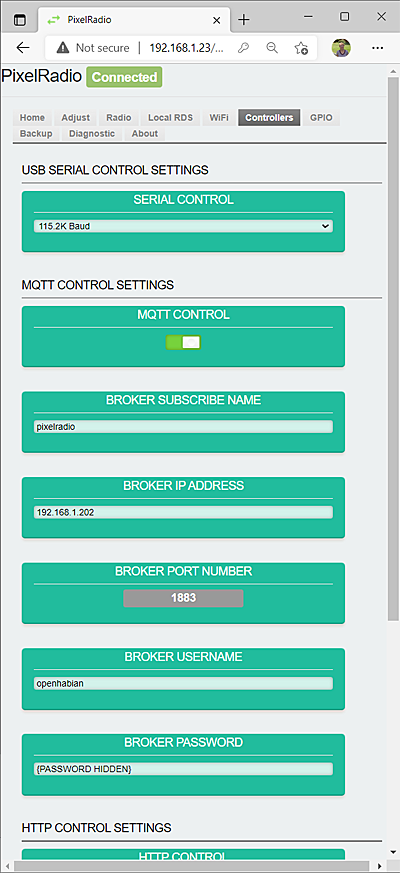
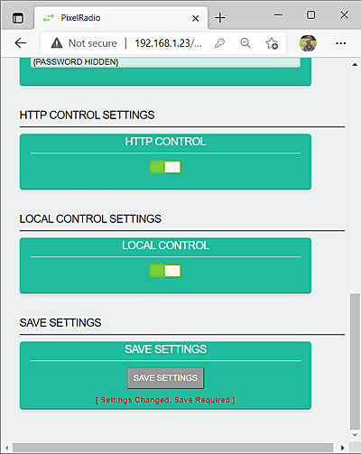

# 

# CONTROLLERS TAB

PixelRadio is a FM Radio Transmitter with RDS (Radio Data System) capabilities.
It was developed for holiday "Pixel" displays (e.g., animated Christmas lights).

The `CONTROLLERS` Tab is used to configure PixelRadio's RDS Controllers.
There are four different controllers and each can be used to execute RadioText commands.

>For information on using the Controllers please see this: [CONTROLLERS](./Controllers.md)

&nbsp;&nbsp;&nbsp;

<table>
<tr>
<td>

---

## USB SERIAL CONTROL SETTINGS

The `USB SERIAL CONTROL SETTINGS` group is used to configure a USB connected Serial Controller.
It can be disabled if a Serial Controller is not used.

### SERIAL CONTROL

The `SERIAL CONTROL` panel is used to enable the Serial Controller.
Four baud rates are supported. All are 8-bit, no parity, 1 stop (8N1).

> IMPORTANT: When Serial Control is enabled the Diagnostic Tab's [SERIAL LOG LEVEL](./DiagTab.md#code-debugging) should be set to 'Silent.'

---

## MQTT CONTROL SETTINGS

The `MQTT CONTROL SETTINGS` group is used to configure the MQTT Controller.
It can be disabled if MQTT is not used.

>MQTT operation requires an MQTT Broker that is on your local network.
>WAN / Cloud based MQTT brokers are not supported.

### MQTT CONTROL

The `MQTT CONTROL` panel is used to enable the MQTT Controller.
Move the slide switch to the right to enable MQTT.

### BROKER SUBSCRIBE NAME

The `BROKER SUBSCRIBE NAME` panel is used to enter the MQTT subscription name that is used by the Broker.

### BROKER IP ADDRESS

The `BROKER IP ADDRESS` panel is used to enter the MQTT Broker's IP.
The address must be in a valid range for your local network.

### BROKER PORT NUMBER

The `BROKER PORT NUMBER` panel is used to display the Broker's Port.
The default value is 1883, which is the most commonly used port number.
The port value is hardcoded and changing it will require an edit to `config.h` and recompiling the firmware.

### BROKER USERNAME

The `BROKER USERNAME` panel is used to enter the Broker's Login Username.
Maximum size is eighteen (18) characters.

### BROKER PASSWORD

The `BROKER PASSWORD` panel is used to enter the Broker's Login Password.
Maximum size is forty-eight (48) characters.

</td>
</tr>
</table>

&nbsp;&nbsp;&nbsp;

<table>
<tr>
<td>

---

## HTTP CONTROL SETTINGS

The `HTTP CONTROL SETTINGS` group is used to configure the HTTP Controller.

### HTTP CONTROL

The `HTTP CONTROL` panel is used to enable/disable HTTP.

If HTTP Control is not used then disable it by moving the slide switch to the left side.

## LOCAL CONTROL SETTINGS

The `LOCAL CONTROL SETTINGS` group is used to configure the Local Controller.

### LOCAL CONTROL

The `LOCAL CONTROL` panel is used to enable/disable the Local Conroller.

If Local Control is not used then disable it by moving the slide switch to the left side.
When it is disabled the RadioText messages entered on the [LOCAL RDS](./LocalTab.md) Tab will also be disabled.

&nbsp;&nbsp;&nbsp;

---

## SAVE SETTINGS

Any changes can be saved as default "Power-Up" settings.
Press the ``Save Settings`` button to store ALL current settings.

</td>
</tr>
</table>

&nbsp;&nbsp;&nbsp;

---

# RETURN TO OVERVIEW

Return to the Menu Overview page: [Click Here](./Overview.md).
