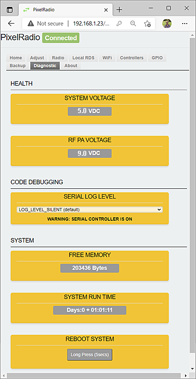

# 

# DIAG TAB

PixelRadio is a FM Radio Transmitter with RDS (Radio Data System) capabilities.
It was developed for holiday "Pixel" displays (e.g., animated Christmas lights).

The `DIAG Tab` provides system diagnostic functions.

&nbsp;&nbsp;&nbsp;

<table>
<tr>
<td>

---

## HEALTH

The `HEALTH` group displays power supply measurements.

### SYSTEM VOLTAGE

The `SYSTEM VOLTAGE` panel reports the logic supply's voltage.
It should be 5.0VDC ±10%.

### RF PA VOLTAGE

The `RF PA VOLTAGE` panel reports the RF Power Amplifier supply's voltage.
It should be 9.0VDC ±10%.

---

## CODE DEBUGGING

The ESP32's USB serial port can provide useful troubleshooting messages for `CODE DEBUGGING` purposes.
The messages are grouped in six levels that are used to filter out lower priority information.

A terminal program is needed to see the log messages.
A popular choice is <a href="https://www.putty.org/" target="_blank">PuTTY</a>

The default baud rate is 115.2K, 8-bit, no parity, 1 stop (8N1).
However, the default baud will be overridden if the [Controller Tab's SERIAL CONTROL](./ControlTab.md#serial-control) setting has been enabled.

### SERIAL LOG LEVEL

Select the 'SERIAL LOG LEVEL' as needed.
For example, choose LOG_LEVEL_VERBOSE to enable ALL logged messages.

>IMPORTANT: When not using the Serial Log feature it should be set to LOG_LEVEL_SILENT.
>This will disable the log feature.
---

## SYSTEM

The `SYSTEM` group reports free memory and run time. Plus it can reboot PixelRadio.

### FREE MEMORY

The `FREE MEMORY` panel shows the ESP32's available heap memory.

### SYSTEM RUN TIME

The `SYSTEM RUN TIME` shows how long the device has been running.

### REBOOT SYSTEM

`REBOOT SYSTEM` is used to warm-boot PixelRadio.
This should have the same affect as power cycle cold-boot.

Press and hold the 'Long Press' button for at least five (5) seconds.
The reboot will begin when the button is released.
The reboot can be canceled by releasing the button before the five second window expires.

</td>
</tr>
</table>

&nbsp;&nbsp;&nbsp;

---

# RETURN TO OVERVIEW

Return to the Menu Overview page: [Click Here](./Overview.md).
