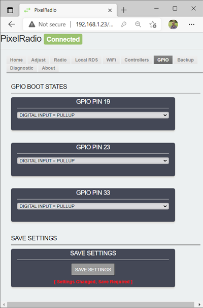

# 

# GPIO TAB

PixelRadio is a FM Radio Transmitter with RDS (Radio Data System) capabilities.
It was developed for holiday "Pixel" displays (e.g., animated Christmas lights).

The `GPIO Tab` is used to configure the three programmable GPIO Pins.
These can be used for On/Off control of other devices via any of the four Controllers.
For example, use one of the GPIO pins to turn on a audio amplifier for your outdoor speakers when the light show begins.

<table>
<tr>
<td>

---

## GPIO BOOT STATES

The `GPIO BOOT STATES` group is used to configure the three GPIO pin states at boot time.

After boot, the GPIO pins are typically managed by the Serial, MQTT, or HTTP Controllers.
The command keywords used to control the GPIO pins are summarized on the [RDS Controllers page](Controllers.md#command-keywords).
For Local Control the GPIO Tab's boot state entries can be changed during runtime.

### GPIO PIN 19

The `GPIO PIN 19` panel is used to configure the boot state for GPIO 19.

### GPIO PIN 23

The `GPIO PIN 23` panel is used to configure the boot state for GPIO 23.

### GPIO PIN 33

The `GPIO PIN 33` panel is used to configure the boot state for GPIO 33.

---

## SAVE SETTINGS

Any changes can be saved as default "Power-Up" settings.
Press the ``Save Settings`` button to store ALL current settings.

</td>
</tr>
</table>

---

&nbsp;&nbsp;&nbsp;

# RETURN TO OVERVIEW

Return to the Menu Overview page: [Click Here](./Overview.md).
