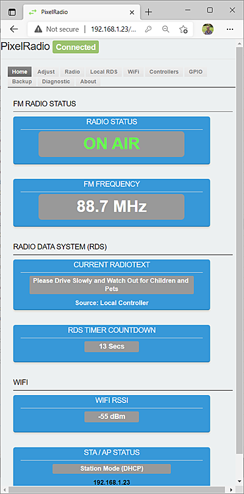

# 

# HOME TAB

PixelRadio is a FM Radio Transmitter with RDS (Radio Data System) capabilities. 
It was developed for holiday "Pixel" displays (e.g., animated Christmas lights).

The `Home Tab` Provides read-only status of the FM Radio, RadioText Message, and WiFi connection.
During operation it can be useful to monitor this screen to confirm that your system settings are correct.

&nbsp;&nbsp;&nbsp;

&nbsp;&nbsp;&nbsp;

# RETURN TO OVERVIEW

Return to the Menu Overview page: [Click Here](./Overview.md).
