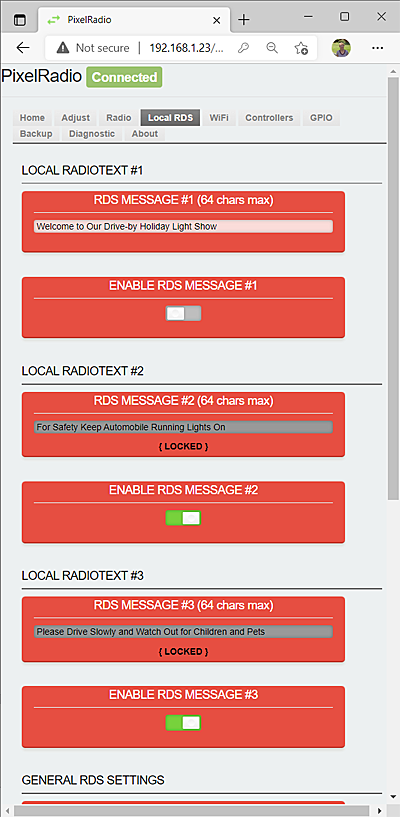
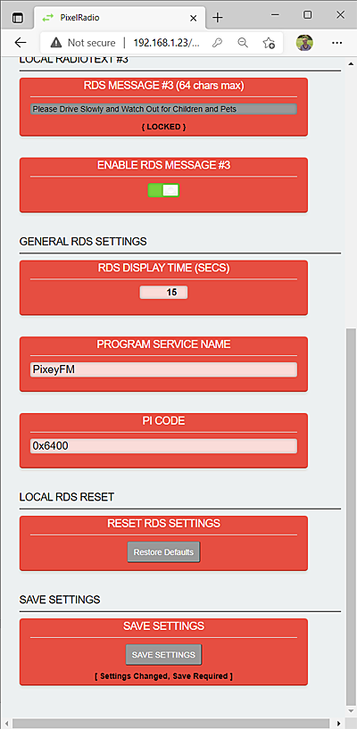

# 

# LOCAL RDS

PixelRadio is a FM Radio Transmitter with RDS (Radio Data System) capabilities.
It was developed for holiday "Pixel" displays (e.g., animated Christmas lights).

The `LOCAL RDS` Tab is used to configure the Local Controller's RadioText features.
The various settings allow you to enter three different RadioText Messages, the display time and Program Service Name (Station Identification).

Keep in mind that PixelRadio supports four different RDS controllers. The entries on this page are only for the
Local Controller.

<table>
<tr>
<td>

&nbsp;&nbsp;&nbsp;

## LOCAL RADIOTEXT #1 - #3

The three `LOCAL RADIOTEXT` groups are used to enter the Local Controller's RadioText Messages.
A RadioText message can be up to 64 characters long.
Any text readable character can be used.

### RDS MESSAGE #1 - #3
Three different RadioText messages can be created.
Each message can be disabled when it is not needed.
The messages can be changed as often as required.

>Text scrolling is highly discourage by the RDS standards; therefore scrolling is NOT supported.

### ENABLE RDS MESSAGE #1 - #3

The `ENABLE RDS MESSAGE` panel is used to enable/disable the corresponding RadioText message.
When the slide switch is towards the right (enabled) the RadioText will be sent to all radio receivers.

When the RDS Message is enabled it cannot be edited.
That is to say, moving the slide switch to the left will unlock the RadioText message and allow editing.

Be sure to move the switch to the right side after editing.
This will lock the message and allow it to be sent to radio receivers.
</td>
<tr>
<td>

&nbsp;&nbsp;&nbsp;

---

## GENERAL RDS SETTINGS

The `GENERAL RDS SETTINGS` group is used to set the Local Controller's RDS Display Time, Program Service Name, and Program ID.

### RDS DISPLAY TIME

The `RDS DISPLAY TIME` panel is used to change the time period for the RadioText messages.
The minimum time is 5 seconds and the maximum is 900 seconds (15 minutes).

The time can be manually entered or altered using the up/down scroll buttons.

>The RDS Time setting will be used as the default RDS display period on the other three controllers.
>However, all controllers can freely change their display period.

### PROGRAM SERVICE NAME

The `PROGRAM SERVICE NAME` (PSN) panel is used to enter your Station ID or Name.
It can be up to eight characters.

What you enter here will appear on the Radio Receiver's PSN field.
Suggestions would be something like "GHOSTS!" for a halloween show.
Or perhaps "SANTA" for your Christmas light show.

>Refrain from changing the PSN name too often.
>Some receivers store the name for future searches and unneccessarily changing it may affect that feature.

### PI CODE

The `PI CODE` panel is used to enter the Program Identification code for your radio station.
The default 0x6400 setting is typically used.

If you are interested in changing it then be sure to avoid using one that is already found in your broadcast area.
For example, USA installations can consult online information like this one:
<a href="https://picodes.nrscstandards.org/fs_pi_codes_allocated.html" target="_blank">NRSC PI Codes</a>

---

## RESET RDS SETTINGS

The `RESET RDS SETTINGS` can be used to restore all the default Local RDS Settings.
This will not affect the other RDS controllers.

Simply press the `Restore Defaults` button to revert all the entries.
Be sure to `Save` the restored settings if you want to retain them.

</td>
</tr>
</table>

---

## SAVE SETTINGS

Any changes can be saved as default "Power-Up" settings.
Press the ``Save Settings`` button to store ALL current settings.

---

# RETURN TO OVERVIEW

Return to the Menu Overview page: [Click Here](./Overview.md).

