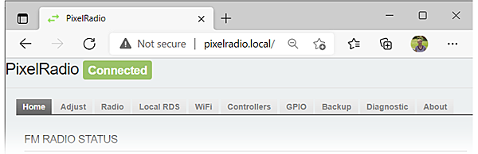

# 

# MENU OVERVIEW

PixelRadio is a FM Radio Transmitter with RDS (Radio Data System) capabilities. It was developed for holiday "Pixel" displays (e.g., animated Christmas lights).

> Before continuing please be sure to read our Introductory document: [Click Here](./README.md).

## SYSTEM TABS

PixelRadio's menus are divided into ten different pages. Each appears as a selectable Tab that is found on the menu bar.

#### [TAB SUMMARY TABLE](#tab-summary-table)
  
|#| TAB NAME | DESCRIPTION | DOC LINKS |
|---|---------|-----------------------|-----------------|
|1.| HOME| System Status | [GO HERE](./HomeTab.md) |
|2.| ADJUST| Frequency Adjust & Audio Control | [GO HERE](./AdjustTab.md) |
|3.| RADIO | FM Radio Configuration | [GO HERE](./RadioTab.md) |
|4.| LOCAL RDS | Local RadioText Messages | [GO HERE](./LocalTab.md) |
|5.| WIFI | WiFi / Network Settings | [GO HERE](./WifiTab.md) |
|6.| CONTROLLERS | System Controllers | [GO HERE](./ControlTab.md) |
|7.| GPIO | General Purpose I/O Configuration | [GO HERE](./GpioTab.md) |
|8.| BACKUP | System Backup and Restore | [GO HERE](./BackupTab.md) |
|9.| DIAGNOSTICS | Troubleshooting and Diagnostics | [GO HERE](./DiagTab.md) |
|10.| ABOUT | System About Summary | [GO HERE](./AboutTab.md) |

## SYSTEM CONTROLLERS

To fully utilize the RadioText features it's important to understand PixelRadio's RDS Controllers. There are four of them, named as follows:
1. Serial Controller
2. MQTT Controller
3. HTTP Controller
4. Local Controller

Each controller provides a way to send RadioText commands.
At this point it's only important to recognize that there are four independant methods to manage your RDS messages.

To learn about the four RDS Controllers please visit this page: [CONTROLLERS](./Controllers.md)

### GPIO CONTROL
The controllers can also receive commands to control the onboard programmable I/O pins.
For example, you can use your existing MQTT broker to control a custom device connected to PixelRadio.
Perhaps use it to turn on the audio amplifier for your outdoor speakers when the light show begins.

## LEARN MORE

It's time to become familiar with PixelRadio.
Click each of the [DOC LINKS](#tab-summary-table) in the table shown above to learn how to use all the features.

