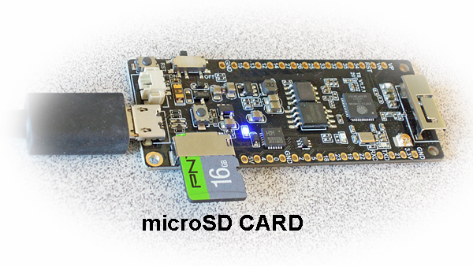
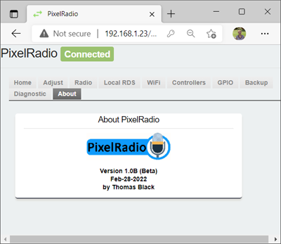

# 

# USER MANUAL : Introduction

PixelRadio is a FM Radio Transmitter with RDS (Radio Data System) capabilities. It was developed for holiday "Pixel" displays (e.g., animated Christmas lights) and house projection installations.

Besides transmitting audio (voice/music) to drive-by visitors, it can also send RadioText messages to RDS compatible automobile radios.
The RadioText can be anything you want; such as artist name or information about your animated pixel show.

## WEB BROWSER COMPATIBILITY

PixelRadio's User Interface (UI) is a web based design.
That is to say, it is an IoT device.
Don't worry, it uses your Local WiFi network and is not Cloud based.
It purposely does not make any calls to the internet, everything is local.

Access is via desktop or mobile browsers. The chosen browser must support WebSocket communication;
no problem for nearly any modern browser, but older versions will not work.

Validation was performed with the latest desktop versions of FireFox, Chrome, and Microsoft Edge.
Android testing used Silk and Chrome.
All worked without issue.
Internet Explorer is considered end-of-life and is not supported by PixelRadio.

## USER INTERFACE ACCESS

Accessing some IoT devices requires knowing their IP address.
And you can certainly connect to PixelRadio using its IP.
But a more convenient method is to use PixelRadio's mDNS name instead of the IP address.
By default the mDNS based URL is http://pixelradio.local

>Not all operating systems support mDNS. In those situations you must use an IP address.

## STA MODE / AP MODE

The first time you boot PixelRadio it won't know your WiFi credentials.
So it's unable to connect to the local network as a traditional WiFi Station (STA) connection.
But it has a backup plan for that event.
After it fails to connect it will switch to Accss Point (AP) mode.
An Access Point works the same as a mobile hotspot.

### AP MODE INSTRUCTIONS
When AP mode is active you should browse the available hotspots shown in your system's WiFi network list.\
Connect to PixelRadio as follows:
1. Find "PixelRadioAP" in the network list and select it.
2. When prompted, enter ``Pixel$Lights`` as the hotspot password.
3. IP Address 192.168.4.1 will be assigned, which is a common AP mode IP used by ESP based devices.

You can now enter ``http://192.168.4.1`` or ``http://pixelradio.local`` to access PixelRadio.
Your browser will request the login credentials as explained in the ``Browser Login`` section shown below.

**IMPORTANT:** AP access is for emergency use only.
It provides temporary access so you can properly configure your system.
To prevent AP Mode from recurring, please select PixelRadio's ``WiFi Tab`` and setup the router's credentials.
Be sure to save your changes too.

### STA MODE INSTRUCTIONS
Normal access uses WiFi station (STA) mode.
After you've saved the WiFi settings and rebooted, PixelRadio will automatically connect to your WiFi router.
Open your browser and enter either the IP address or mDNS name.
See the ``User Interface Access`` section above.

## BROWSER LOGIN (Username / Password)
Browser login is required to access the Web Interface (both STA and AP modes).
The credentials can be changed.
And if necessary, they can be disabled so that browser login is not required at all.

The default login credentials are:\
User Name: ``pixel``\
Password: ``lights``
> IMPORTANT: credentials are case sensitive.

## EMERGENCY WIFI CREDENTIALS

So you've exhausted all attempts to connect PixelRadio to your WiFi router.
Or perhaps the router credentials have changed or there is a static IP conflict.
No worries, there is a workaround for those unfortunate scenarios.

A micro SD Card can be used to configure your router's credentials and restore DHCP access.\
Here's what to do:
<span>


1. Format a micro SD Card (32GB or less) as FAT32.
2. Use a text editor and copy the following line to it:\
```{"WIFI_SSID_STR":"<SSID_NAME>", "WIFI_WPA_KEY_STR":"<WPA_KEY>"}```
3. Change the <SSID_NAME> and <WPA_KEY> to match your router's credentials.\
for Example:\
``{"WIFI_SSID_STR":"HomeNetworkWiFi", "WIFI_WPA_KEY_STR":"Secrete$Key#onlyIknow"}``
4. Save the file on the card's root directory using this name:\
```credentials.txt```
5. Insert the card in PixelRadio's SD card slot and reboot it (press reset or power cycle).
6. Wait about one minute, then verify your browser can now access PixelRadio.
>Note: For security, the credentials.txt file will be deleted after device reboot.
</span>

## TAB MENU SUMMARY

<span>PixelRadio has extensive programmable features, all of which are accessible via the web interface.
The features are divided into several different menus that appear as Tabs.

The ten Tabs can be seen in this screenshot.</span>



Each Tab provides access to the system controls that are divided into logical groups.
Begin your Tab education by starting here: [Menu Overview](./Overview.md).
