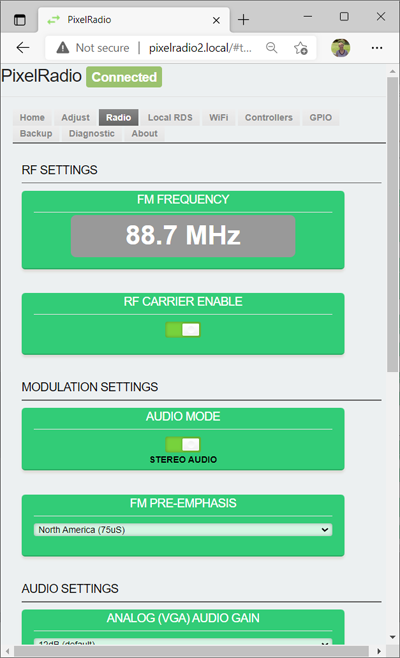
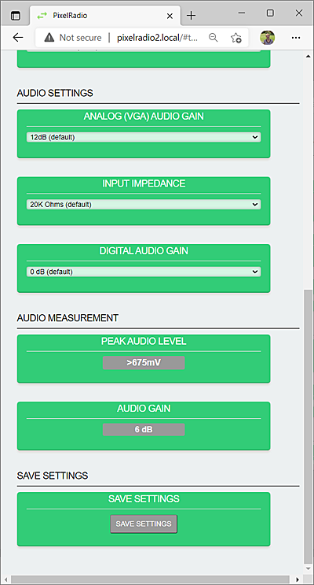

# 

# RADIO TAB

PixelRadio is a FM Radio Transmitter with RDS (Radio Data System) capabilities.
It was developed for holiday "Pixel" displays (e.g., animated Christmas lights).

The `Radio Tab` is used to configure the FM Transmitter hardware.
Such as Global Region specific settings as well as basic audio source level adjustments.

<table>
<tr>
<td>

&nbsp;&nbsp;&nbsp;

## RF SETTINGS

The `RF SETTINGS` group is for the transmitter's RF Carrier configuration.

### FM FREQUENCY

The ``FM FREQUENCY`` panel shows the current transmit frequency.
It can be changed on the [ADJUST](./AdjustTab.md#frequency-adjust) Tab.

### RF CARRIER ENABLE

The `RF CARRIER` can be disabled by setting the slide switch to the left side.
This will turn off the radio transmission (both audio and RDS).

Typical use is to test the RadioText features without broadcasting a signal.
A good radio operator only transmits when it is necessary.

>Note: The optional "On Air" sign is controlled by the state of the RF Carrier.
The sign will turn off when the RF carrier is disabled.

The other Controllers can also enable / disable the RF Carrier.
The RF Carrier Control action is provided by the _rfc_ command keyword.
Its syntax is described in the [Controllers](./Controllers.md#command-keywords) section (see Command Keywords table).

---

## MODULATION SETTINGS

The `MODULATION SETTINGS` group is used to configure the FM signal's modulation characteristics.

### AUDIO MODE

The `AUDIO MODE` switch is used to set the audio modulation type (Stereo or Mono).

`Mono Audio` mode disables the transmitter's 19KHz stereo pilot tone.
It reduces RF bandwidth so radio range (distance) is increased.
So unless you absolutely need stereo audio it is suggested to choose the mono mode.

### FM PRE-EMPHASIS

The `PRE-EMPHASIS` setting is used to improve the signal to noise ratio in a FM signal.
Due to local radio standards this setting varies by global location.

The North America (75uS) setting is for the USA, South Korea and Japan.

The Europe (50us) setting is for locations such as the UK, EU and Australia.
This setting is commonly used for global territories outside North America.

It is best to check which pre-emphasis choice is used by FM broadcasters in your area.
As a last resort you can listen to the receiver's audio.
An incorrect pre-emphasis choice will cause either too much treble or too much bass.
Listen carefully because it can be difficult to discern either of these issues.

</td>

<tr>
<td>

&nbsp;&nbsp;&nbsp;

---

## AUDIO SETTINGS

PixelRadio has a phone jack that accepts a standard 3.5mm 3-pole stereo plug.
Audio can be from any source that has a low level "Line" output.

The `AUDIO SETTINGS` are used to match the transmitter's audio input to your analog audio source.

### ANALOG (VGA) AUDIO GAIN

The `ANALOG AUDIO GAIN` selector is used to change the audio signal amplification.
If the setting is too high then audio will have distortion.
If set too low the listener will be forced to increase their receiver's audio level.
That can be a big problem when they return to their regular radio station (a.k.a. ear damage).

### INPUT IMPEDANCE

The `INPUT IMPEDANCE` selector must be set to match your audio source's impedance.
If the impedance is not known then experiment with the various choices to find which provides the optimum audio level.

The Input Impedance setting interacts with the Analog Audio Gain setting.
It may be necessary to adjust both settings to achieve the desired results.

### DIGITAL AUDIO GAIN

The `DIGITAL AUDIO GAIN` selector provides a minor change in audio level.
The default setting is typically used.

---

## AUDIO MEASUREMENT

The `AUDIO MEASUREMENT` provides a real-time peak voltage measurement of the audio signal.

### PEAK AUDIO LEVEL

The `PEAK AUDIO LEVEL` displays the peak millivolt value of the audio signal.
This value will change as the music or voice audio levels change.
Due to hardware limitations it can only measure up to 675mV maximum.

In practice, it is suggested to use an audio level that is slightly under the 675mV measurement limit.
It is Ok if it occasionally hits the limit.
The goal is to provide the highest receiver audio level without inviting distortion.

>Commercial radio broadcasters are able to blast the airwaves with high audio levels because they utilize audio compression.
>Their goal is not to provide highest quality, it is centered on being loudest.
>If you wish to duplicate their characteristically loud levels then use a software tool like Audacity to compress your audio files.

### AUDIO GAIN

The `AUDIO GAIN` panel reports the amount of audio gain that is being used.
The displayed value is a product of the Analog Audio Gain Setting and the Input Impedance Setting.
Changing either of those settings will change the Audio Gain value.
</td>
</tr>
</table>

---

## SAVE SETTINGS

Any changes can be saved as default "Power-Up" settings.
Press the ``Save Settings`` button to store ALL current settings.

---

# RETURN TO OVERVIEW

Return to the Menu Overview page: [Click Here](./Overview.md).
