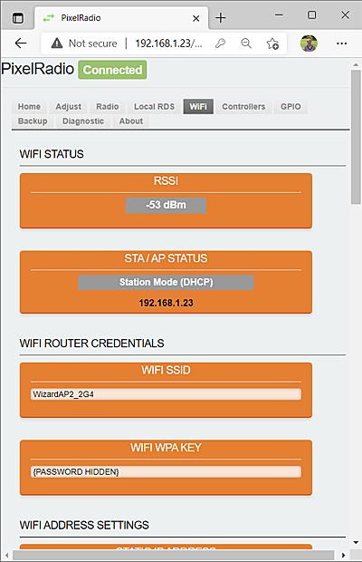
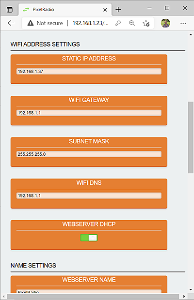
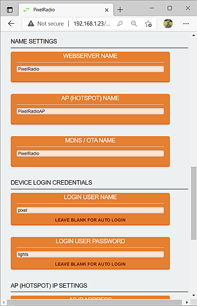
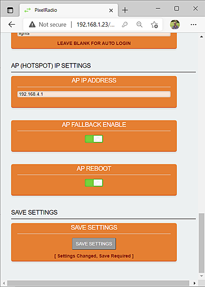

# 

# WIFI TAB

PixelRadio is a FM Radio Transmitter with RDS (Radio Data System) capabilities.
It was developed for holiday "Pixel" displays (e.g., animated Christmas lights).

The `WIFI` Tab is used to configure the WiFi and Networking features.

&nbsp;&nbsp;&nbsp;

<table>
<tr>
<td>

---

## WIFI STATUS

The `WIFI STATUS` group reports Router signal strength and network connection mode.

### RSSI

The `RSSI` panel is the Received Signal Strength Indicator.
It reports the Router's signal strength and the value is in dBm.
The more negative the number the weaker the signal.
Values that exceed -62dBm may experience unreliable connections.

### STA / AP STATUS

The `STA / AP STATUS` panel reports the connection mode.

Normal network connections use the `STA` (Station) mode.
This connection type requires a WiFi router.

`AP` mode does not use a WiFi Router.
Instead PixelRadio creates an Access Point (Mobile HotSpot).
This connection type is for emergency access only.
It is intended to allow temporary access to PixelRadio so you can configure new installations.

>For AP Mode instructions please see this: [STA / AP Information](./README.md#sta-mode--ap-mode)

---

## WIFI ROUTER CREDENTIALS

The `WIFI ROUTER CREDENTIAL` group is used to configure the Router's SSID and password.

### WIFI SSID

The `WIFI SSID` entry must match your router's SSID.
The SSID must be no larger than 32 characters.

### WIFI WPA KEY

The `WIFI WPA KEY` entry must match your router's password key.
The password key must be no larger than 32 characters.

</td>
</tr>
</table>

&nbsp;&nbsp;&nbsp;

<table>
<tr>
<td>

---

## WIFI ADDRESS SETTINGS

The `WIFI ADDRESS SETTINGS` group is used to configure the WiFi IP related settings.

### STATIC IP ADDRESS

The `STATIC IP ADDRESS` panel is an optional setting.
It is only required if a static IP address is needed.
Otherwise DHCP will be used and IP addresses will be assigned by your WiFi router.

The Static IP Address must be within a valid range for your local network.
Be certain that the chosen IP is not already in-use.
It is also advisable to reserve the static IP in your WiFi Router.
If this seems too complicated to you then use the [WEBSERVER DHCP](#webserver-dhcp) mode instead.

### WIFI GATEWAY

The `WIFI GATEWAY` panel is used to enter your router's gateway address.
PixelRadio does not use WAN connections so this entry is currently not used.
But a valid entry should be entered in case future firmware adds WAN functions.

### SUBNET MASK

The `SUBNET MASK` panel is used to enter your local network's subnet.
The most common setting is `255.255.255.0`.
It is unlikely you will need to use a different value.

### WIFI DNS

The `WIFI DNS` panel is used to enter your router's DNS address.
The most common setting is the IP address of your router.

### WEBSERVER DHCP

The `WEBSERVER DHCP` panel allows you to choose DHCP or Static IP.

When the slide switch is on the right side the `DHCP` mode will be enabled.
DHCP allows your router to manage the IP Address assignment.

When the slide switch is moved to the left side the `Static IP` Mode will be enabled.
You must enter a valid [STATIC IP ADDRESS](#static-ip-address) before enabling Static mode.

</td>
</tr>
</table>

&nbsp;&nbsp;&nbsp;

<table>
<tr>
<td>

---

## NAME SETTINGS

PixelRadio's network names have already been assigned for you.
However, the names can be changed in the `NAME SETTINGS` group.
This is useful if you are managing more than one PixelRadio device.

### WEBSERVER NAME

The default `WEBSERVER NAME` is "PixelRadio".
Change this entry if another name is needed.
Maximum length is eighteen (18) characters.

### AP (HOTSPOT) NAME

The default `AP (HOTSPOT) NAME` is "PixelRadioAP".
Change this entry if another name is needed.
Maximum length is eighteen (18) characters.

### MDNS / OTA NAME

The default `MDNS / OTA NAME` is "PixelRadio".
Change this entry if another name is needed.
Maximum length is eighteen (18) characters.

The mDNS name will be used for connecting PixelRadio to your local network instead of an IP address.\
For example:\
 http://pixelradio.local

>Not all operating systems support mDNS.
>If that is the case then PixelRadio's IP address can be used in the browser's URL.\
For example:\
http://192.168.1.37

The OTA (Over-the-Air) name is the same as mDNS.
OTA is for developers that want to perform wireless firmware updates.

---

## DEVICE LOGIN CREDENTIALS

The Web Browser requires `DEVICE LOGIN CREDENTIALS`.
The defaults are as follows:\
`LOGIN USER NAME`: pixel\
`LOGIN USER PASSWORD`: lights

For network security it is recommended that you change the default credentials.
Any printable character can be used and credentials are case sensitive.

Login will not be necessary if both credential entries are empty.

### LOGIN USER NAME

The default `LOGIN USER NAME` is "pixel".
Please change it.
Maximum length allowed is ten (10) characters.
Leave blank if browser login is not wanted.

### LOGIN USER PASSWORD

The default `LOGIN USER PASSWORD` is "lights".
Please change it.
Maximum length allowed is ten (10) characters.
Leave blank if browser login is not wanted.

</td>
</tr>
</table>

&nbsp;&nbsp;&nbsp;

<table>
<tr>
<td>

---

## AP (HOTSPOT) IP SETTINGS

PixelRadio will create an AP (Access Point) HotSpot if it cannot connect to your WiFi Router.
The `AP (HOTSPOT) IP SETTINGS` group is used to configure the AP mode.

The AP Hotspot mode is for temporary access to PixelRadio.
During first use please configure the WiFi Router settings. This will disable the AP mode.

### AP IP ADDRESS

The default `AP IP ADDRESS` is 192.168.4.1.
If necessary it can be changed.

### AP FALLBACK ENABLE

The AP HotSpot feature can be disabled.
Move the `AP FALLBACK ENABLE` switch to the left side to disable it.
When disabled the HotSpot will NOT be created if the Router connection fails.

### AP REBOOT

PixelRadio will try several times to connect to your WiFi Router.
If the AP Fallback feature is disabled a reboot will occur after several failed attempts to connect.
The reboot can be disabled by moving the `AP REBOOT` switch to the left side.

---

## SAVE SETTINGS

Any changes can be saved as default "Power-Up" settings.
Press the ``Save Settings`` button to store ALL current settings.

</td>
</tr>
</table>

&nbsp;&nbsp;&nbsp;

---

# RETURN TO OVERVIEW

Return to the Menu Overview page: [Click Here](./Overview.md).
