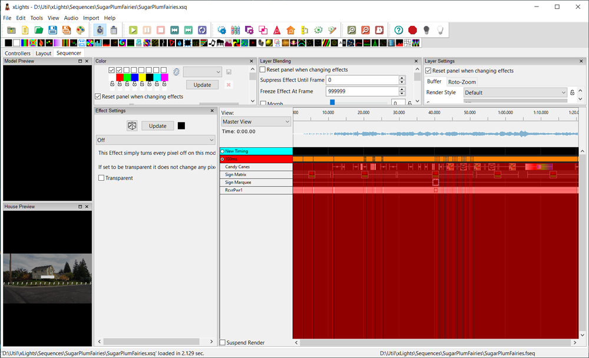
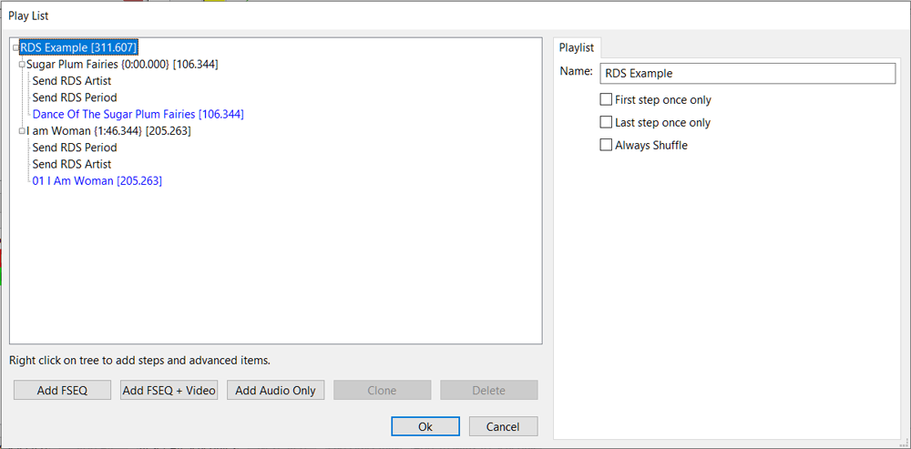
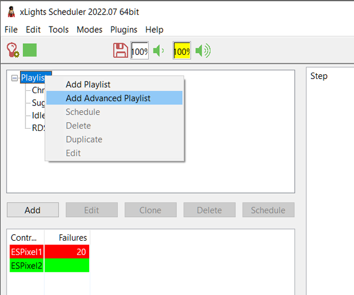
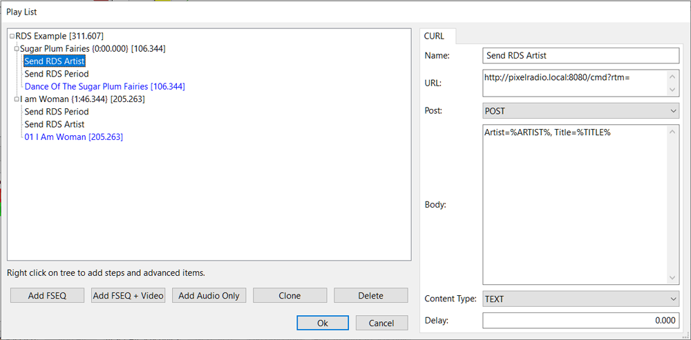
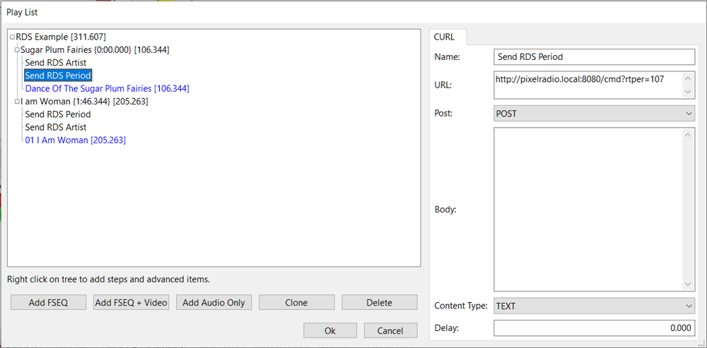

# 

# xLIGHTS EXAMPLE

PixelRadio is a FM Radio Transmitter with RDS (Radio Data System) capabilities.
It was developed for holiday "Pixel" displays (e.g., animated Christmas lights).

PixelRadio can be controlled by any of its four built-in controllers.
They are named Serial, MQTT, HTTP, and Local Control.

>For general information on using the Controllers please see: [CONTROLLERS](./Controllers.md)

New users will probably start with the Local Controller to send RDS RadioText messages.
It's simple to use;
it takes just a moment to create up to three different RadioText messages that can be sent to nearby automobile radios.
Such as announcing your charity event or advising drivers to watch out for small children.

But perhaps you want to be more creative.
For example, let's say that you get a lot of visitors asking for the names of the artists that sang the music playing on their radio.
Fortunately MP3 files have embedded metadata that provides album name, song title, and artist.
It's possible to create a show playlist that automatically extracts this information and sends it as RadioText.
How cool is that!

>Note: Some MP3 Files do not include any metadata.
>Be sure to check your MP3 files and confirm they have it.
>If it is missing then you can use a metadata editor and add the song name, artist, and album information yourself.

In the next section we will explain how to automatically send the MP3's metadata in the RadioText messages.
Our example will use PixelRadio's HTTP controller.

&nbsp;&nbsp;&nbsp;

---

# xLIGHTS: Introduction

To help get you started we will utilize PixelRadio's HTTP controller.
Some of the magic will be provided by *xLights*, a popular pixel animation software program.
Of course there are other ways to control PixelRadio and it may be possible to use a different pixel animation program.

*xLights* is used to create sequencing files.
These contain the data that control your pixels.
Here's a screenshot of the editor.

<table>
<tr>
<td>

</td>
</tr>
</table>

It can also schedule file playback using its playlist feature.
Playlists use the *xScheduler* utility, which is a companion program included with xLights.

The xLights suite is a free download.
There are versions that run on Linux, Mac OS/X, and Windows.
Our example screenshots are from the Windows 10 version (2022.07 release).

The software can be obtained here: [xLights Download](https://github.com/smeighan/xLights).

&nbsp;&nbsp;&nbsp;

---

# xLIGHTS: FSEQ Files

Pixel animation sequences that were created by the *xLights* editor are saved as FSEQ files.
Several can be combined to build a sophisticated light show that entertains your visitors all night long.

The *xSchedule* utility is used to select the FSEQ sequence files to include in your pixel light show.
The steps are ordered in a group that is called a playlist.

We've already mentioned that PixelRadio has a HTTP controller that can receive RDS / RadioText commands.
This makes xScheduler a great companion since it has a cURL (client URL) POST feature that can send HTTP commands.
You will soon see that xScheduler conveniently allows us to group our RadioText Commands with the FSEQ files.

&nbsp;&nbsp;&nbsp;

---

# xSCHEDULER: Send RDS Using Curl Post

So let's create a simple playlist with two FSEQ files.
The FSEQ files have our pixel animations and their synced MP3 music.

>Note: All example screenshots were created using the Windows 10 version of xScheduler.

We are going to build a playlist that looks like this:

<table>
<tr>
<td>

</td>
</tr>
</table>

1. Begin by launching the xScheduler.

3. Right-Click **Playlist** and select **Add Advance Playlist**.
See screenshot below.

<table>
<tr>
<td>

</td>
</tr>
</table>

3. Give the playlist a name.
The example is named **RDS Example**.

4. Click the **Add FSEQ** button and add your first FSEQ file.
The example has two FSEQ files named *Sugar Plum Fairies* and *I am Woman*.
Go ahead and add your FSEQ file now.

5. Right-Click the first FSEQ file entry and select **Add CURL**.
We will use xLights system variables to populate the Artist name and song Title into the RadioText.
The `%ARTIST%` and `%TITLE%` variables are used to do this.

6. Give your CURL step a name.
The example has named it *Send RDS Artist*.\
\
Add the HTTP controller's RadioText Message Command URL.\
The example is using:\
`http://pixelradio.local:8080/cmd?rtm=`

7. Choose the **POST** method and content type **Text**.\
Add this text to the Body dialog area: \
`Artist=%ARTIST%, Title=%TITLE%`\
\
Your entries should like this:

<table>
<tr>
<td>

</td>
</tr>
</table>

8. Click **OK**.
Drag the *Send RDS Artist* step so it is a "subfolder" under the `Sugar Plum Fairies` FSEQ entry and delete the empty orphan step.

9. Right-Click the first FSEQ file entry again and select **Add CURL**.
We will use this step to send the RadioText Period (*rtper*) command.

10. Give your CURL step a name.
The example has named it *Send RDS Period*.
Add the HTTP controller's *rtper* Command URL.
The payload should be set to the song's length.
This song is 106.3 seconds long so the example is using 107 seconds.\
The URL should look like this:\
`http://pixelradio.local:8080/cmd?rtper=107`

11. Choose the **POST** method and content type **Text**.\
The Body dialog should be empty.\
\
Review your entries.
They should like this:

<table>
<tr>
<td>

</td>
</tr>
</table>

12. Click **OK**.
Drag the *Send RDS Period* step so it is a "subfolder" under the `Sugar Plum Fairies` FSEQ entry and delete the empty orphan step.

13. You can add more FSEQ files and their corresponding RDS commands if you wish.
When you're done building your playlist you can click **OK**.
Select **File->Save** to save your new playlist.

14. Select your new Playlist and press **Play Selected**.
Confirm that while listening to the music your RadioText appears on the radio's RDS display.

&nbsp;&nbsp;&nbsp;

---

# RETURN TO RDS CONTROLLERS

Return to the RDS Controllers page: [Click Here](./Controllers.md).
