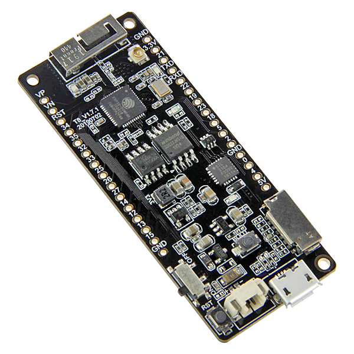

# 

# PROJECT SOFTWARE

PixelRadio is a FM Radio Transmitter with RDS (Radio Data System) capabilities. It was developed for holiday "Pixel" displays (e.g., animated Christmas lights) and house projection installations.

# 
This is an open source project.
So all firmware source code is available to download.

Programming experience will be needed if you intend to make improvements to the code.
The target device is a LilyGO TTGO-T8 ESP32 microcontroller.

## SOFTWARE BUILD REQUIREMENTS

Compiling the source code requires VSCode with the [PlatformIO IDE](https://platformio.org/platformio-ide) extension.
Current release compiles on Platformio Core 5.2.5, Home 3.4.1.

The software is written in C and requires PlatformIO's Espressif32 board platform and Arduino framework.
Current release was built using Espressif32 3.5.0.

This project uses open source ESP32 Arduino Libraries.
However, the source code will not successfully compile with the Arduino IDE. Please use PlatformIO.

&nbsp;&nbsp;&nbsp;

---

# INSTALLING THE FIRMWARE

The firmware can be installed two ways.
The recommended method uses the PlatformIO IDE.
But an alternate method is to use the uploader program that is provided by `Espressif`.
Both methods are discussed below.

## PLATFORMIO IDE (Build & Flash)

The firmware can be uploaded directly from the PlatformIO Build Environment.
Begin by launching PlatformIO and open the PixelRadio Folder.

### PLATFORMIO FILE EDITS
1. Edit the `platformio_user.ini` file and change the COM Port numbers to match your TTGO ESP32 device.
2. Rename the `credentials_user.h` file to `credentials.h` and add your WiFi settings.
3. Advanced users can edit `config.h` to alter the features; first time users should use the file as-is.

### PLATFORMIO UPLOAD

Select PlatformIO's Upload function.
This will build the firmware and perform the Upload.

Initial Uploads may fail due to missing libraries.
Simply repeat the Upload and the missing dependencies will be added to the project so it can be built.
A successful build will automatically launch the file uploader and Flash the ESP32 device.

After a successful Upload, execute PlatformIO's `Upload Filesystem Image` function.
This will Flash the data files needed by PixelRadio.

## ALTERNATE UPLOAD METHOD (ESP32 Uploader)

It's not necessary to use PlatformIO to Build and Upload the firmware.
That's because a compiled binary file is provided in the zip download.
The binary can be Flashed onto the ESP32 microcontroller using espressif `Flash Download Tool`.

Espressif's software utility runs on the Windows platform.
For other operating systems please do a web search for a ESP32 Flash Tool that is compatible with your PC environment.

The Flashing Tool is available here: <a href="https://www.espressif.com/en/support/download/other-tools" target="_blank">DOWNLOAD FLASH TOOL</a>

### FLASH DOWNLOAD TOOL INSTRUCTIONS

1. Install the Flash Download Tool.

2. At the Flash Download Tool's root folder, create a sub-folder named `/bin`.\
Copy the following PixelRadio files to the sub-folder:\
&nbsp;&nbsp; boot_app0.bin\
&nbsp;&nbsp; bootloader_dout_40m.bin\
&nbsp;&nbsp; partitions.bin\
&nbsp;&nbsp; pixelradio.bin

3. Launch the Flash Download Tool.\
Choose `ESP32` for chipType.\
Choose `develop` for the workMode.\
Choose `uart` for the loadMode.\
Press `OK`.

4. On the SPIDownload Tab, add the four bin files (see screenshot for example).\
Important: The file paths must match your `/bin` folder location.\
Confirm the bin offsets are correctly entered, as follows:\
&nbsp;&nbsp; bootloader_dout_40m.bin @ 0x1000\
&nbsp;&nbsp; partitions.bin @ 0x8000\
&nbsp;&nbsp; boot_app0.bin @ 0xe000\
&nbsp;&nbsp; pixelradio.bin @ 0x10000

5. Enable all the settings shown in the screenshot.\
Important: The `COM` entry must match your ESP32's USB COM port.

6. Using a USB cable, connect the TTGO ESP32 to your PC.
Do not connect PixelRadio's 12VDC power supply.\
Press Start (located at the lower left corner of Flashing Tool).\
Flashing takes about a minute.
If the upload fails then check your settings and try again.\
Unplug the ESP32 after the upload is successful.

7. One support file must be manually added using a microSD card.\
The microSD Card (32GB or less) must be formatted as FAT32.\
Copy the `RadioLogo225x75_base64.gif` file from the project data folder to the SD Card.\
Do NOT rename the file.

8. Insert the SD Card into the ESP32 and apply power.\
Wait one minute then remove the SD card.

9. PixelRadio is now ready to use.

&nbsp;&nbsp;&nbsp;

---

# USER MANUAL
Now that PixelRadio is programmed it's a good time to review the instruction manual.
Start here: [User Manual](../docs/User_Manual/README.md).
